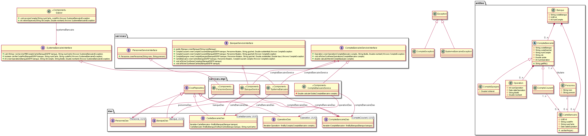

# TP de formation Java - V2

Ce TP a pour objectif de développer une gestion *basique* d'un système bancaire. La version *V2* permet d'aborder la persistence des données
avec JPA/Hibernate.

Le système bancaire à développer est représenté sur le modèle de classe suivant. Le travail réalisé dans la *V1.1* a consisté à implémenter 
les classes de ce modèles (les *entités*), les liaisons entre ces classes ainsi que les différences composants *métier*. Ce travail sert de 
base à l'implémentation de la *V2*.



La branche `master`contient le squelette du projet. La branche `correction` fournit une correction type. Le squelette contient un fichier de configuration Maven nécessaire à la compilation de ce projet. Il n'est pas nécessaire d'intervenir sur ce fichier.

Travail attendu:
- Implémentation de la persistence des entités (annotations + DAO)
- Utilisation des DAO dans les services
- Adaptation des tests unitaires

Enfin, pour les plus courageux, il est demandé de ré-écrires les méthodes d'affichage des synthèses par des pages JSP.

**Bon courage**

# Pour lancer les tests

## BanqueServiceTest

Click droit sur le fichier, "Run As JUnit Test".

## BanqueServiceWithContextJavaTest

Click droit sur le fichier, "Run As JUnit Test".

## BanqueServiceWithContextFilesTest

Avant de lancer les tests sont ce fichier, ouvrir un terminal et lancer un terminal
avec la commande suivante :

```shell
java -cp ~/.m2/repository/com/h2database/h2/1.4.200/h2-1.4.200.jar org.h2.tools.Server -tcp -web -ifNotExists
```

Ensuite, click droit sur le fichier, "Run As JUnit Test".
