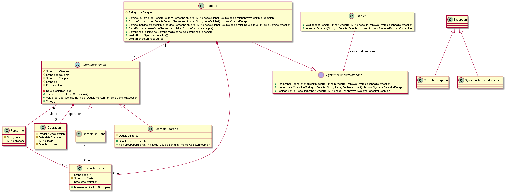

# TP de formation Java - V0

Ce TP a pour objectif de développer une gestion *basique* d'un système bancaire. La version *V0* permet d'aborder les concepts de base de la 
programmation objet et du langage Java.

Le système bancaire à développer est représenté sur le modèle de classe suivant. Le travail consiste donc à implémenter les classes de ce
modèles, les liaisons entre ces classes ainsi que les différences méthodes *métier*.



La branche `master`contient le squelette du projet. La branche `correction` fournit une correction type.

Pour les tests, la classe `BanqueV0Application` contient une fonction `main()` qui teste un certain nombre de cas d'utilisation.


## Exemples de cas d'utilisation

### Création d'une banque, d'un titulaire et d'un compte courant

On créé une banque avec le code banque `DGFiP`, une personne titulaire et on lui créé un compte courant dans le guiche bancaire `1234`:

```
Banque maBanque = new Banque("DGFIP");
Personne paulette = new Personne("Blanchard", "Paulette");
CompteCourant ccPaulette = maBanque.creerCompteCourant(paulette, "1234");
```

### Réalisation d'une opération de débit d'un compte

```
ccPaulette.creerOperation("Dépôt chèque", 100.0); // Crédit
ccPaulette.creerOperation("Intérêts débiteurs", -3.54); // Débit (montant négatif)
```

**Attention** : pour les comptes d'épargne (classe `CompteEpargne`) il n'est pas permis d'avoir un solde négatif sur le compte. Il s'agit
d'une règle de gestion à implémenter.

### Attributation d'une carte bancaire

```
CarteBancaire cbPaulette = maBanque.creerCarte(paulette, ccPaulette);
```

### Utilisation du Gabier

Le `Gabier` est considéré comme un élément externe. Il n'interagit pas directement avec les classes du système bancaire mais propose une
interface `SystemeBancaireInterface`. Cette interface doit donc être implémenté par notre système bancaire afin de pouvoir s'interfacer
avec le Gabier.
La méthode `accesComptes` permet au gabier d'accéder aux comptes bancaires associés à la carte dont le numéro est fournit en argument.
L'accès n'est autorisé par le système bancaire uniquement si le codePIN fournit en argument correspond au code PIN de la carte.

```
Gabier gabier1 = new Gabier(maBanque);  // La classe Banque doit implémenter l'interface SystemeBancaireInterface

//Retrait de 314 sur le compte courant de Paulette
try
{
    List<String> comptesPaulette = gabier1.accesComptes(cbPaulette.getNumCarte(), cbPaulette.getCodePin());
    System.out.println("*** Liste de comptes de Paulette:");
    for(String rib: comptesPaulette) {
        System.out.println("  - " + rib);
    }
    int numOperation = gabier1.retirerEspeces(comptesPaulette.get(0), 314.0);
    System.out.format("*** Opération réalisée: %d  ***", numOperation);
    ccPaulette.afficherSyntheseOperations();
}
catch (SystemeBancaireException e)
{
    System.err.println("Accès impossible aux comptes de Paulette: " + e.getMessage());
}
```

## Affichage des synthèses

Afin de vérifier le bon fonctionnement du système bancaire, la classe `Banque` doit fournir 2 méthodes permettant d'afficher la synthèse
des comptes et des cartes gérées par la banque.

### Exemple d'affichage de la synthèse des comptes `afficherSyntheseComptes()`

```
+-----------------+--------------------------+----------------------+------------+
| Type compte     | RIB                      | Titulaire            | Solde      |
+-----------------+--------------------------+----------------------+------------+
| Compte epargne  | DGFIP 5678 0000000003 99 | Labbe André          |   10000,00 |
| Compte courant  | DGFIP 5678 0000000001 99 | Guibert Dominique    |    -100,00 |
| Compte epargne  | DGFIP 1234 0000000002 99 | Guillou Thibault     |    4000,00 |
| Compte courant  | DGFIP 1234 0000000000 99 | Blanchard Paulette   |      50,00 |
+-----------------+--------------------------+----------------------+------------+
```

### Exemple d'affichage de la synthèse des cartes `afficherSyntheseCartes()`

```
+----------------------+----------------------+----------+
| Titulaire            | Num. Carte           | Code PIN |
+----------------------+----------------------+----------+
| Guibert Dominique    | 4328 1561 1140 6510  | 5613     |
| Blanchard Paulette   | 5870 7649 3910 6948  | 5088     |
+----------------------+----------------------+----------+
```

Sur le même principe la classe abstraite `CompteBancaire` doit disposer d'une méthode permettant de lister les opérations du compte.

### Exemple d'affichage de la synthèse des cartes `afficherSyntheseOperations()`

```
Synthèse du compte: DGFIP 5678 0000000001 99
Titulaire: Guibert Dominique
+---------+-------------------------+-------------------------+------------+
| Num opé | Date opération          | Libellé                 | Montant    |
+---------+-------------------------+-------------------------+------------+
|       0 | 2021-05-23T09:33:19     | SOLDE INITIAL           |       0,00 |
|       1 | 2021-05-23T09:33:19     | Dépôt espèces           |     200,00 |
|       2 | 2021-05-23T09:33:19     | Débit                   |    -300,00 |
+---------+-------------------------+-------------------------+------------+
Solde:    -100,00
```


**Bon courage**