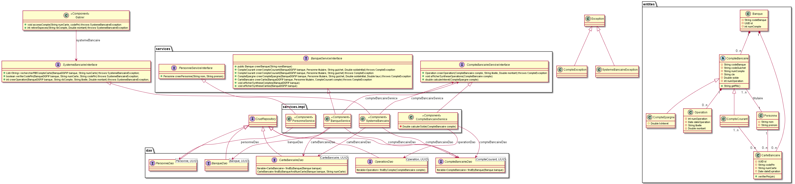

# TP de formation Java - V2

Ce TP a pour objectif de développer une gestion *basique* d'un système bancaire. La version *V2* permet d'aborder la persistence des données
avec JPA/Hibernate.

Le système bancaire à développer est représenté sur le modèle de classe suivant. Le travail réalisé dans la *V1.1* a consisté à implémenter 
les classes de ce modèles (les *entités*), les liaisons entre ces classes ainsi que les différences composants *métier*. Ce travail sert de 
base à l'implémentation de la *V2*.

La branche `master`contient le squelette du projet. La branche `correction` fournit une correction type. Le squelette contient un fichier de configuration Maven nécessaire à la compilation de ce projet. Il n'est pas nécessaire d'intervenir sur ce fichier.

Pour les tests, la classe `InitDonneesRunner` charge un certain nombre de données. 

**Bon courage**